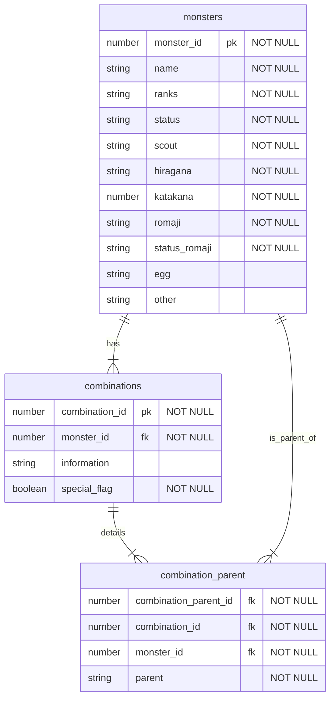

# ドラゴンクエストモンスターズ３ 配合検索アプリ

## 概要

- 任天堂 Switch と Steam にある「ドラゴンクエストモンスターズ３ 魔族の王子とエルフの旅」というゲームの配合検索アプリ

- モンスターの一覧を確認できる(ランクごと、系統ごとも可)

- モンスター名を入力して検索することも可能

- 配合検索では作りたいモンスター名を入力することで、そのモンスターを配合するのに必要なモンスターを確認できる。

- 入力したモンスターを利用して新たに作ることができるモンスターも確認できる

## デモ動画

https://github.com/user-attachments/assets/a6ebcc14-f419-4935-8e07-141c2a14d501

## 使用技術

- Next.js
- TypeScript
- TailwindCSS
- MySQL

## データベース設計

